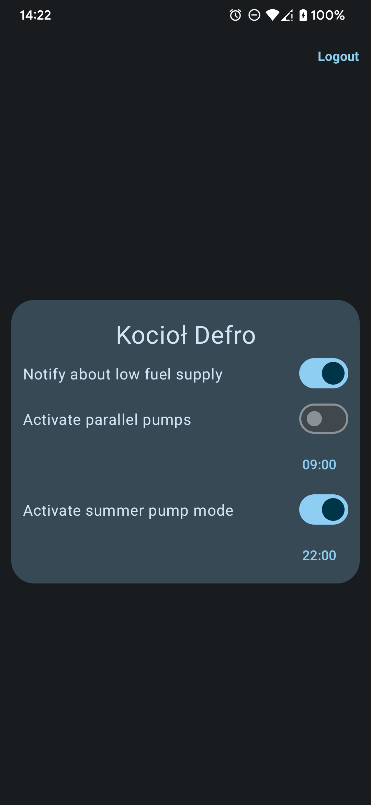

# Emodul Notifier

A mobile application used to automate the activation of pumps at a set time for Defro cauldrons and to notify about low fuel supply.
Based on API - https://emodul.eu/docs/api-v1.txt \[Last access 13.10.2023]

## Features

- Login screen
- Multiple module support(multiple cauldrons)
- Separate settings for each module

## Run

```sh
# Clone the project:
git clone https://github.com/damianhoppe/EmodulNotifier.git
cd EmodulNotifier

# Running the application:
flutter run [--release]
```

## Screenshots

 